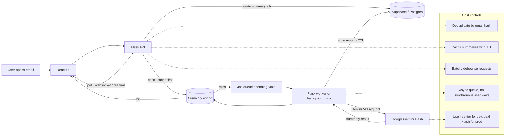

# Summary Inference Flow

```mermaid
flowchart LR
  U[User opens email] --> UI[React UI]
  UI --> API[Flask API]

  API -->|create summary job| DB[(Supabase / Postgres)]
  API -->|check cache first| CACHE[(Summary cache)]
  CACHE -->|hit| UI
  CACHE -->|miss| Q[Job queue / pending table]

  Q --> W[Flask worker or background task]
  W -->|Gemini API request| G[Google Gemini Flash]
  G -->|summary result| W
  W -->|store result + TTL| DB
  W --> CACHE

  UI <-->|poll / websocket / realtime| API

  subgraph Cost controls
    C1[Deduplicate by email hash]
    C2[Cache summaries with TTL]
    C3[Batch / debounce requests]
    C4[Async queue, no synchronous user waits]
    C5[Use free tier for dev, paid Flash for prod]
  end

  API -.-> C1
  API -.-> C2
  API -.-> C3
  W -.-> C4
  G -.-> C5
```